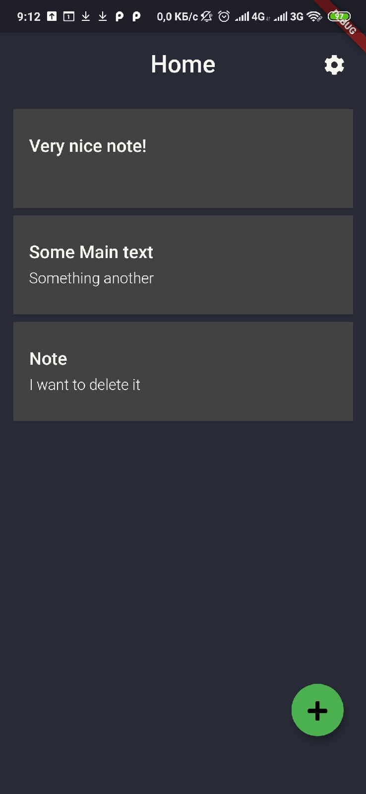
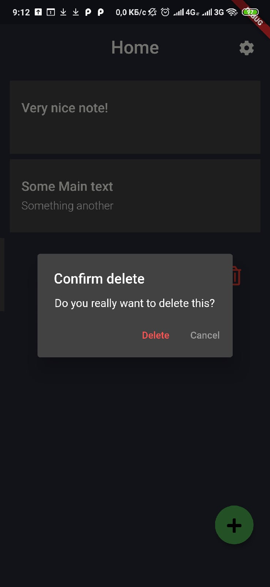
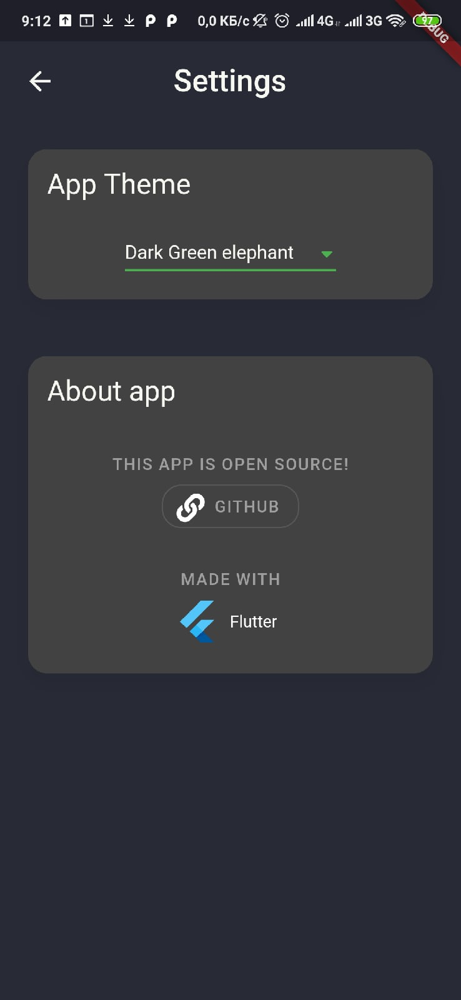
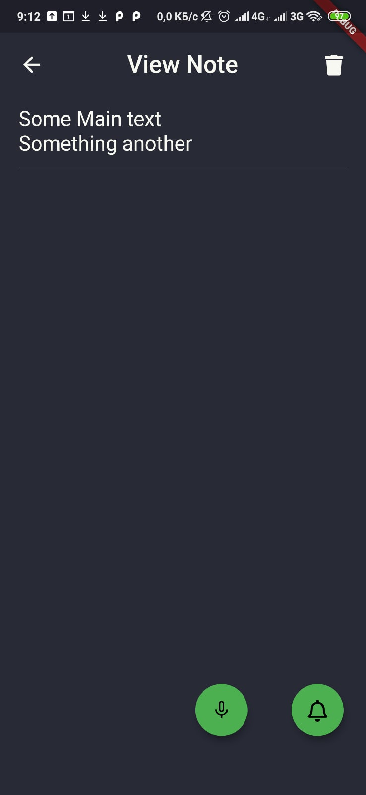
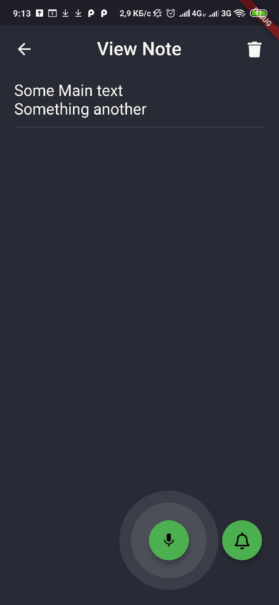
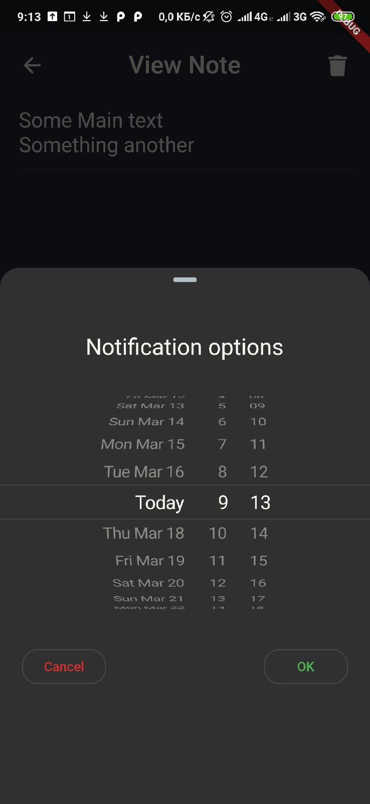

# Notes application on Flutter

Link go GooglePlay: https://play.google.com/store/apps/details?id=com.company55.notes

## Screens

In this app you are able to make notes, delete, edit them using voice input and schedule notifications.

### Main

In the Home page you can open or delete existing note, create new or open settings.

  
  

### Settings
Here you can change theme or open this repository

  

### View Note
In this screen you can delete or edit note, use voice input and set notification

  
  

### Set notification
In this screen you can schedule notification.

  

